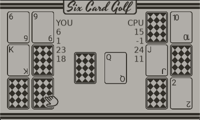

# 2 Players Six Card Golf

<p align="center">
  
</p>

_First love2d game, mostly done to learn more on Lua. A [Playdate](https://play.date/) port was in mind which is why it uses limited controls and has 1-bit graphics. I might finish the game once I get my console._
- [Overview](#Overview)
- [How to play](#How-to-play)
- [Special Thanks](#Special-Thanks)

## Overview

### Goal
Have the lowest score after 9 rounds.

### Board setup
Each player receives 6 cards face down, all cards left are put in a draw pile. One card from the draw pile is put in a discard pile, face up.

### Turn actions
The players have two choices of action each turn
- Turning up a face-down card on their board
- Drawing a card: from the discard pile (the one on top) or the draw pile.

    If they chose to draw a card, they can replace any card on their side with the one drawn. They can also choose not to use it, and can simply discard it.

The turn now ends, and the next player can start.

The game ends the turn after a player turned face up all their cards. (The other player can do one last turn, before they need to turn all their cards face up, in this game, this is done automatically)

### Scoring
- Jokers are worth -5
- Any pairs of cards are worth 0 points
- Kings are worth 0 points
- Every other card is worth their rank

## Controls
- Arrow keys: Control your cursor
- X: Click on cards
- Z: Close popups

# How to play

## From source code

If you cloned the repo, you will need to download [LÖVE](https://www.love2d.org/) first then you can launch the game with:

```
love six-card-golf/six-card-golf
```

## From executable

You can find those in the [latest release](https://github.com/CGagnier/six-card-golf/releases)

## From the web

Available on [itch.io]()


## Special Thanks

To [simplegametutorials](https://github.com/simplegametutorials) which made me learn quite a lot on Lua. You can find more on their [website](https://simplegametutorials.github.io/love/). 

After following [this tutorial on building a blackjack game](https://simplegametutorials.github.io/love/blackjack/), it gave me the idea to try to port one of my favorite card game, some logic from the tutorial was adapted in my code.